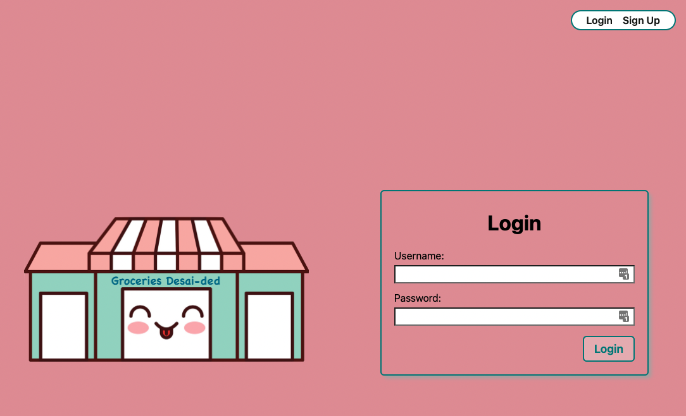
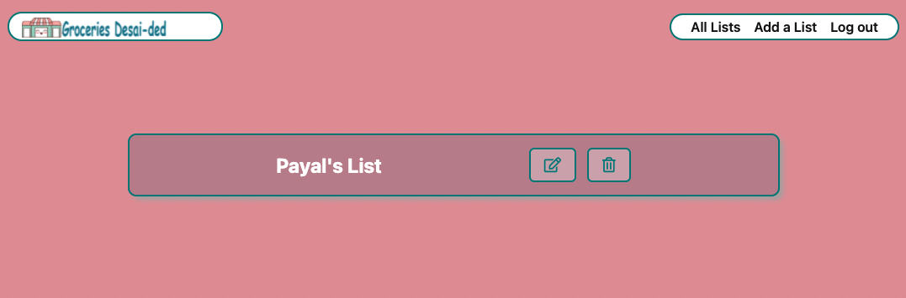
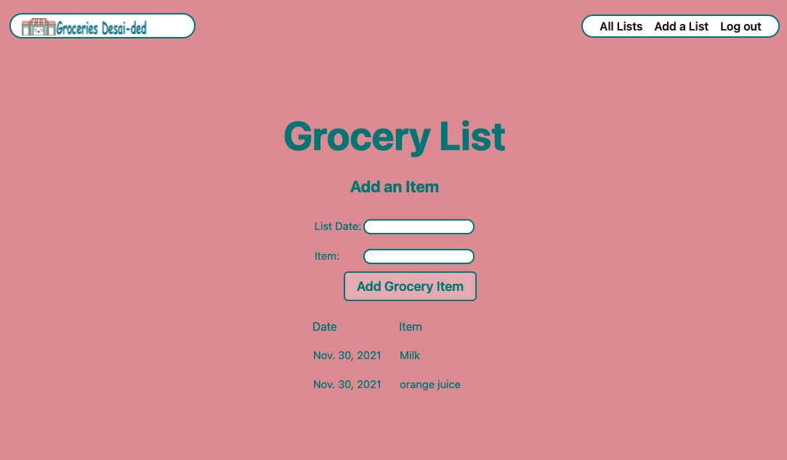

## :notebook: Background:
The inspiration behind Groceries Desai-ded because as someone who likes to take screen shots of handwritten grocery lists and email them to myself; I needed to find a single place to store the grocery lists in order to reference them in the future. This way I could avoid accidentally deleting the lists I emailed myself. I hope this app will not only help me but also help you to. 

## :camera: Groceries Desai-ded Screenshots

## :point_right: [Try Me Out!](https://groceriesdesaided.herokuapp.com/)
You can check out my Trello board [HERE!](https://trello.com/b/J7TzgDSw/groceries-desai-ded)

## :star: Technologies Used
- JavaScript
- CSS
- Heroku
- HTML
- Python

## :star:Future Additions:
- Send text alerts to members
- add pictures from an api

## :green_heart: Credits
- www.vectorstock.com